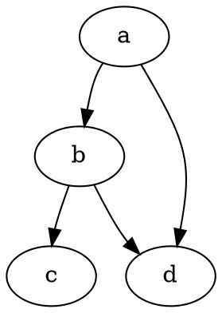

Первая запись за столько лет

1. Перед этим будет много текста. 1.
2. Перед этим будет много текста. 2.
3. Перед этим будет много текста. 3.
4. Перед этим будет много текста. 4.
5. Перед этим будет много текста. 5.
6. Перед этим будет много текста. 6.
7. Перед этим будет много текста. 7.
8. Перед этим будет много текста. 8.
9. Перед этим будет много текста. 9.

Окончание проверочного текста. Тем самым мы заершаем преамбулу на начальной странице.

Пример подцветки кода.


#include <stdio.h>
#include <stdlib.h>

int main(int argc, char **argv) {
  return EXIT_SUCCESS;
}


Таблица



Диаграмма


participant participant as Foo
actor       actor       as Foo1
boundary    boundary    as Foo2
control     control     as Foo3
entity      entity      as Foo4
database    database    as Foo5
collections collections as Foo6
queue       queue       as Foo7
Foo -> Foo1 : To actor 
Foo -> Foo2 : To boundary
Foo -> Foo3 : To control
Foo -> Foo4 : To entity
Foo -> Foo5 : To database
Foo -> Foo6 : To collections
Foo -> Foo7: To queue



stateDiagram-v2
  open: Open Door
  closed: Closed Door
  locked: Locked Door
  open   --> closed: Close
  closed --> locked: Lock
  locked --> closed: Unlock
  closed --> open: Open


Изображение



Gist



References

https://gohugo.io/content-management/shortcodes
[Who]()

Mathematics

$$f(x) = sin(x) + 12$$


$$
\begin{vmatrix}a & b\\
c & d
\end{vmatrix}
$$

